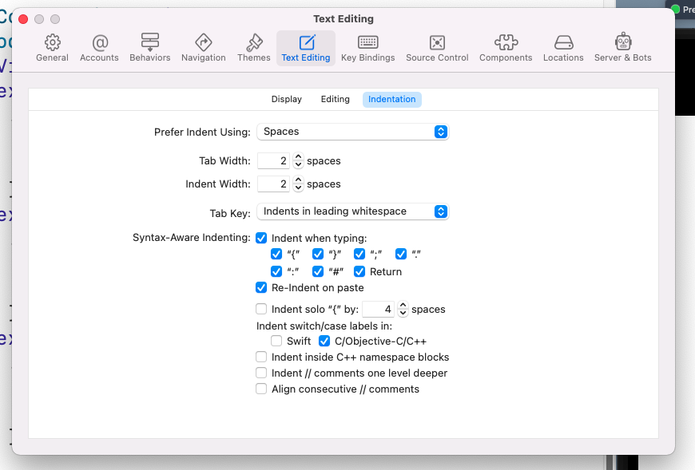

# Week 04 Swift UI 2, Audio

<!-- ## Resource reminder

- [Apple Swift Docs - developer](https://developer.apple.com/documentation/swift)
- [Apple Swift Docs - A Swift Tour](https://docs.swift.org/swift-book/GuidedTour/GuidedTour.html)
- [linkedin swift-5-essential-training ](https://www.linkedin.com/learning/swift-5-essential-training)
- [Ray Wenderlich - your-first-ios-swiftui-app](https://www.raywenderlich.com/28797163-your-first-ios-swiftui-app-an-app-from-scratch) -->

## Review

- [Unwrap app](https://apps.apple.com/app/id1440611372)

  - Learn coding with Swift by Paul Hudson

- [03-closures-ints-strings](https://github.com/mobilelabclass-itp/03-closures-ints-strings)
  - Dictionary/Array/Struct/Class

## Apple Resources

- [AVAudioPlayer](https://developer.apple.com/documentation/avfaudio/avaudioplayer)

- [creating_custom_symbol_images_for_your_app](https://developer.apple.com/documentation/uikit/uiimage/creating_custom_symbol_images_for_your_app)

<!-- ## XCode indent preference

-  -->

## Plan

- review homework

- break

- audio and state management

  - decoding the docs

  - [04-Audio-State-Demo](https://github.com/mobilelabclass-itp/04-Audio-State-Demo)

## Homework Week04

- create your own multi-screen SwiftUI app that incorporates time and/or audio playback.

- add a link to your project on

  - [wiki home page week04](https://github.com/mobilelabclass-itp/content-2023/wiki#week-04-homework)

- submit questions

## Final Project Resources

- Consider audio capabities in this open source library for your final project

  - [AudioKit/Cookbook](https://github.com/AudioKit/Cookbook)
